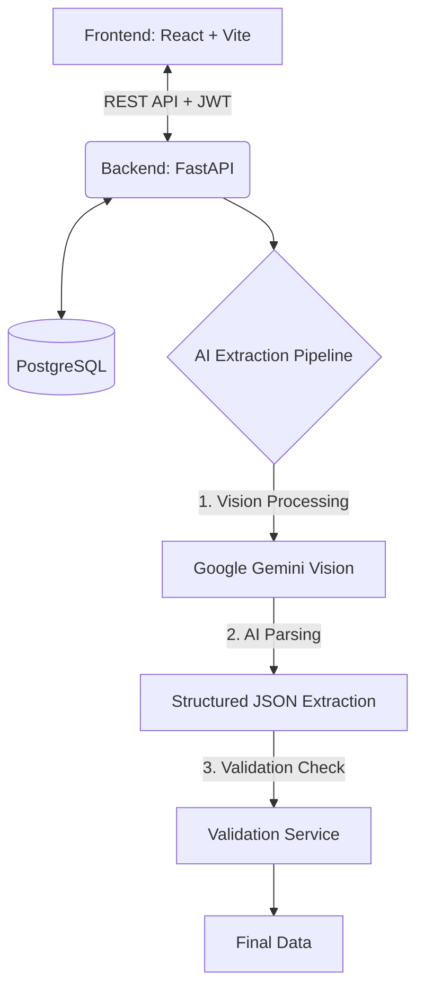

# OptiMed — AI Medical Bill Parser

<div align="center">
  <h3>Intelligent Document Processing for Medical Bills</h3>
</div>

**OptiMed** is an AI-based SaaS system that converts scanned or photographed medical bills (pharmacy invoices, hospital bills, diagnostic reports, and healthcare billing documents) into clean, structured, and queryable JSON data. 

It uses **Google Gemini Vision** for high-accuracy AI-powered document parsing. The system includes a comprehensive React frontend dashboard for bill management, review, analytics, vendor tracking, and data export, backed by a robust FastAPI Python service.

---

## 🚀 Features

- **AI-Powered Document Parsing**: Direct extraction and parsing using Google Gemini Vision models natively structuring the extracted content into standardized JSON formats.
- **Support for Diverse Documents**: Parses Pharmacy Invoices, Hospital Bills/Discharge Summaries, Diagnostic/Lab Reports, and Consultation Receipts.
- **Comprehensive Validation**: Built-in validation for tax formats, dates, mathematical consistency (subtotals/totals), and item integrity.
- **Smart Vendor Management**: Automatic vendor discovery, tracking, and trust scoring based on historical data.
- **Advanced Analytics & Dashboard**: Real-time insights into spend trends, operational metrics, and vendor performance.
- **Client-Side Fraud Detection**: Detects duplicate submissions, anomalies, tampering, and vendor risks.
- **Audit Logging**: Comprehensive tracking of user actions and bill lifecycle events.
- **Correction Tracking**: Diff detection between original AI extraction and user edits.

---

## 🛠️ Tech Stack

| Layer | Technology |
| --- | --- |
| **Frontend** | React 19, TypeScript, Vite 6, TailwindCSS |
| **Backend** | FastAPI 0.115, Python 3.10+, Uvicorn |
| **Database** | PostgreSQL 14+ (via SQLAlchemy 2.0 & Alembic) |
| **AI/OCR** | Google Gemini Vision (2.5-flash / 2.0-flash / 1.5-flash) |
| **Auth** | JWT (python-jose), bcrypt |
| **Containerization** | Docker (Backend) |

---

## 🏗️ Architecture



---

## ⚙️ Prerequisites

Before you begin, ensure you have met the following requirements:
* **Node.js** (v18 or higher)
* **Python** (v3.10 or higher)
* **PostgreSQL** (v14 or higher)
* **Google Gemini API Key**

---

## 💻 Setup Instructions

### 1. Backend Setup

Navigate to the `backend` directory and set up the Python environment:

```bash
cd backend

# Create a copy of the environment template
cp .env.example .env
# Edit .env with your PostgreSQL credentials and Google Gemini API key

# Create and activate virtual environment
python -m venv .venv

# On Windows:
.venv\Scripts\activate
# On Linux/macOS:
# source .venv/bin/activate

# Install dependencies
pip install -r requirements.txt

# Initialize database (creates tables and seed admin user)
python -m app.db.init_db

# Start the FastAPI server
uvicorn app.main:app --reload --host 127.0.0.1 --port 8000
```
*The backend API will be available at `http://localhost:8000`*
*API Documentation (Swagger UI) available at `http://localhost:8000/docs`*

### 2. Frontend Setup

In a new terminal window, navigate to the root directory and start the Vite development server:

```bash
# Install Node dependencies
npm install

# Start the development server
npm run dev
```
*The React application will be available at `http://localhost:3000`*

### ⚡ Quickstart (Windows only)
For Windows users, you can use the provided batch script to start both environments quickly:
1. Run `start_backend.bat`
2. Open a separate terminal and run `npm run dev`

---

## 🔒 Default Credentials

After running `init_db.py`, a default administrator account is created:
* **Email:** `admin@optimed.com`
* **Password:** `admin123`

*(Please change these immediately in a production environment)*

---

## 📁 Key Project Structure

```text
optimed/
├── backend/                  # FastAPI Python backend application
│   ├── app/                  # Main application code
│   │   ├── api/              # API endpoints (v1 routes)
│   │   ├── core/             # Config and security settings
│   │   ├── db/               # Database setup and sessions
│   │   ├── models/           # SQLAlchemy ORM models
│   │   ├── schemas/          # Pydantic validation schemas
│   │   └── services/         # Core business logic & AI pipeline
│   ├── tests/                # Backend unit tests
│   ├── alembic/              # Database migration scripts
│   └── requirements.txt      # Python dependencies
├── components/               # React UI components (Dashboards, Analytics)
├── contexts/                 # React Context providers (State management)
├── services/                 # Frontend API and utility services
├── App.tsx                   # Main React entry component
└── package.json              # Node.js dependencies
```

---

## 📝 License

This project is private and confidential.
